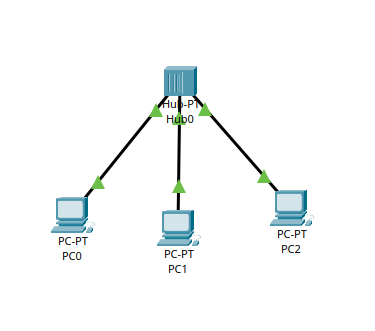
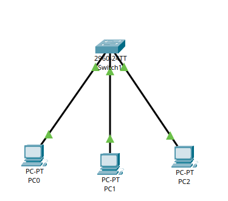

# Ponderada Cisco Packet Tracer - Módulo 09
## [Vídeo 1 - Explicação da ponderada](https://drive.google.com/file/d/1_IbEt4LROsIuevDXl__TTb4_-eJKhqZy/view?usp=sharing)

# Relatório Técnico — Análise de Rede com Hub e Switch no Cisco Packet Tracer
## 1. Introdução
&emsp; Esta atividade teve como foco comparar o comportamento da transmissão de dados em duas topologias físicas equivalentes, variando apenas o dispositivo de interconexão (hub e switch). A análise foi da camada física e dos efeitos no meio de transmissão, incluindo propagação do sinal, compartilhamento do meio e encaminhamento de PDUs.

## 2. Objetivo
&emsp; Validar, em ambiente simulado no Cisco Packet Tracer, as diferenças práticas entre uma rede baseada em hub e uma rede baseada em switch, analisando:

- o comportamento do sinal elétrico no meio físico;
- o impacto do meio compartilhado;
- a forma de entrega de quadros/PDUs entre hosts.

## 3. Materiais e topologia utilizada

- 3 PCs (PC0, PC1, PC2)
- 1 hub (Parte 1)
- 1 switch Cisco 2960 (Parte 2)
- cabos de par trançado
- mesma topologia física nas duas partes

Endereçamento IP configurado:

<strong>Tabela 1 - Endereçamento IP configurado</strong>

| Dispositivo | Endereço IP | Máscara |
|---|---|---|
| PC0 | 10.0.0.5 | 255.0.0.0 |
| PC1 | 10.0.0.6 | 255.0.0.0 |
| PC2 | 10.0.0.7 | 255.0.0.0 |

<em>Fonte: O autor (2026)</em>

## 4. Parte 1 — Rede com Hub

### 4.1 Montagem do cenário
&emsp; Foi montado um cenário com os três PCs conectados a um hub por cabos de par trançado.

<strong>Figura 1 - Montagem da rede com hub</strong>

        
         

<em>Fonte: O autor (2026)</em>

### 4.2 Configuração dos endereços IP
&emsp; Os três hosts foram configurados na mesma rede lógica, conforme tabela da Seção 3:

- PC0: `10.0.0.5`
- PC1: `10.0.0.6`
- PC2: `10.0.0.7`

### 4.3 Testes de conectividade
&emsp; Foram executados testes de `ping` entre os hosts.

[Vídeo 2 - Ping no cenário com hub (05-06)](./assets/videos/hub%20ping%2005-06.mp4)

[Vídeo 3 - Ping no cenário com hub (06-07)](./assets/videos/hub%20ping%2006-07.mp4)

[Vídeo 4 - Ping no cenário com hub (07-05)](./assets/videos/hub%20ping%2007-05.mp4)

### 4.4 Simulação com Simple PDU
&emsp; Foi enviada uma Simple PDU do PC0 para o PC2 em modo de simulação para observar a propagação do tráfego.

[Vídeo 5 - Simple PDU no cenário com hub (PC0 para PC2)](./assets/videos/hub-pdu.mp4)

### 4.5 Análise do comportamento observado
&emsp; O hub opera na camada física (camada 1) e atua como repetidor multiporta. Ao receber um sinal em uma porta, ele replica esse mesmo sinal para as demais portas ativas. Por isso, todos os nós conectados ao hub recebem inicialmente o quadro, mesmo quando o destino final é apenas um host.

### 4.6 Respostas da Parte 1

- A) Por que todos os nós recebem o quadro inicialmente dentro de um hub?
    - R: Todos os nós recebem o quadro inicialmente dentro de um hub, porque o hub não interpreta endereços MAC nem seleciona porta de saída, ele apenas repete o sinal elétrico para todas as portas, exceto a de entrada.

- B) Explique como isso se relaciona ao conceito de meio compartilhado com desempenho real na camada física.
    - R: Como todos os dispositivos compartilham o mesmo domínio de colisão, há uma maior probabilidade de colisões e retransmissões, assim o uso simultâneo do meio reduz a eficiência efetiva de transmissão.

## 5. Parte 2 — Rede com Switch

### 5.1 Montagem do cenário
&emsp; O hub foi substituído por um switch Cisco 2960, mantendo os mesmos três PCs, o mesmo endereçamento IP e a mesma topologia física. Após a conexão, aguardou-se a estabilização das portas.

<strong>Figura 2 - Montagem da rede com switch 2960</strong>

        
         

<em>Fonte: O autor (2026)</em>

### 5.2 Testes de conectividade
&emsp; A conectividade foi validada novamente com `ping` entre os hosts.

[Vídeo 6 - Ping no cenário com switch (05-06)](./assets/videos/switch%20ping%2005-06.mp4)

[Vídeo 7 - Ping no cenário com switch (06-07)](./assets/videos/switch%20ping%2006-07.mp4)

[Vídeo 8 - Ping no cenário com switch (07-05)](./assets/videos/switch%20ping%2007-05.mp4)

### 5.3 Simulação com Simple PDU
&emsp; Foi enviada novamente uma Simple PDU do PC0 para o PC2 em modo de simulação.

[Vídeo 9 - Simple PDU no cenário com switch (PC0 para PC2)](./assets/videos/switch-pdu.mp4)

### 5.4 Análise do comportamento observado
&emsp; O switch opera na camada de enlace (camada 2) para comutação de quadros e usa tabela MAC para encaminhamento. Com o aprendizado dos endereços MAC por porta, o tráfego passa a ser enviado de forma seletiva para a porta de destino, reduzindo propagação desnecessária. Em estágios iniciais de aprendizado, pode ocorrer flooding de quadros desconhecidos, mas o comportamento esperado após aprendizado é o encaminhamento direcionado.

### 5.5 Respostas da Parte 2

- A) Compare o fluxo do sinal elétrico no switch versus hub.
    - R: Comparação entre o fluxo do sinal no switch e no hub:
        - No hub, o sinal recebido é repetido para quase todas as portas;
        - No switch, o quadro é recebido, analisado no nível de MAC e encaminhado preferencialmente só à porta associada ao destino.

- B) Por que agora a PDU não é propagada para todos os nós da mesma forma?
    - R: A PDU não é mais propagada para todos os nós da mesma forma, pois o switch usa aprendizado MAC para identificar a porta correta do destino, assim, evita replicação para todos os hosts, exceto em casos de flooding inicial/quadro desconhecido.

- C) O switch elimina o meio físico compartilhado? Justifique tecnicamente.
    - R: O switch não elimina o meio físico, ainda há enlaces físicos, porém segmenta a rede em múltiplos domínios de colisão, um por porta, removendo o compartilhamento coletivo único típico do hub.

## 6. Comparação entre os cenários

<strong>Tabela 2 - Comparação entre os cenários de hub e switch</strong>

| Critério | Hub | Switch |
|---|---|---|
| Propagação do sinal | Repete para múltiplas portas | Encaminha seletivamente por MAC |
| Comportamento do meio | Meio compartilhado coletivo | Segmentação por porta |
| Eficiência | Menor em carga concorrente | Maior devido à comutação |
| Domínio de colisão | Único e compartilhado | Separado por porta |
| Encaminhamento de tráfego | Não orientado a destino lógico | Orientado por tabela MAC |

<em>Fonte: O autor (2026)</em>

## 7. Conclusão
&emsp; A ponderada mostrou que, embora ambos os cenários mantenham conectividade IP entre os hosts, o comportamento do tráfego no meio físico é distinto. O hub replica sinais e mantém um meio compartilhado coletivo, com maior suscetibilidade a colisões. Já o switch aprende endereços MAC e direciona quadros de forma mais eficiente, reduzindo propagação desnecessária e segmentando os domínios de colisão.
